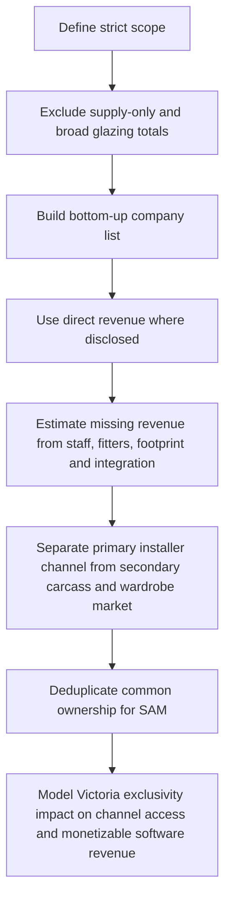
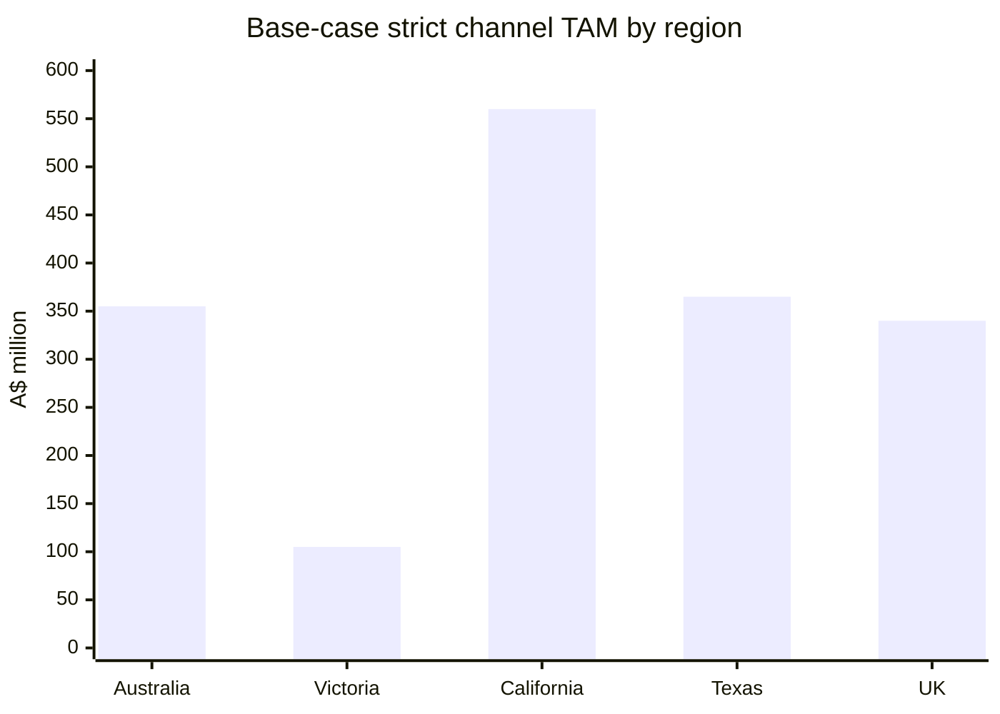
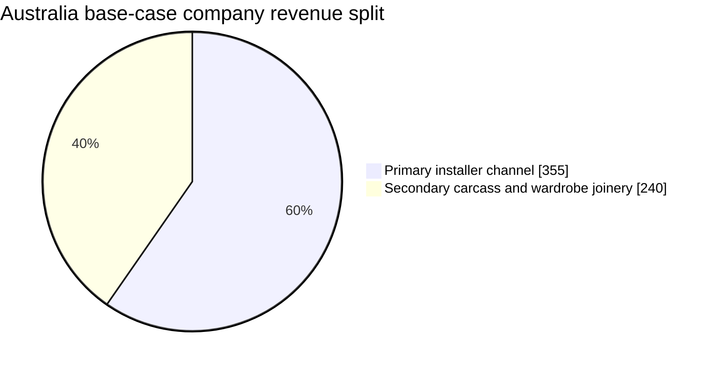

# Market for Site-Measure Supply-and-Install Shower Screens, Mirrors, Splashbacks, Wardrobes and Wardrobe Doors

## Executive summary

The clean answer is this: the **big numbers are real only if you are talking about broad end-market spend or broad glazing/joinery categories**. They are **not** the same thing as the annual revenue pool of the specific companies you actually want to sell into: specialist firms that **site-measure, supply and install** shower screens and mirrors as a minimum, and often also splashbacks, wardrobes and wardrobe doors. Your own uploaded working note shows how broad numbers get large very fast: Australia alone can get to **A$780m for shower screens + A$625m for wardrobe doors + A$185m for splashbacks = A$1.59bn**, before mirrors or wardrobe internals are fully counted. But that is a **broad category-spend view**, not a strict company-revenue view of installer/manufacturer channels over your threshold. fileciteturn0file9L65-L72

After tightening the scope to your actual target channel, my **revised strict Australian primary-market base case** is **about A$355m annual revenue**, with a defensible range of **A$300m–A$420m**. For **Victoria alone**, the base case is **about A$105m**, with a defensible range of **A$80m–A$130m**. That is materially lower than a broad “A$1.4bn+ installer market” claim, and it is much closer to the earlier strict research note you uploaded, which put the Australian primary channel in a lower **A$220m–A$360m** band before adding the 2026 transcript calibration. fileciteturn0file10L7-L9

The 2026 transcripts matter because they **change the weighting of several key players**. Onyx disclosed a run rate of roughly **A$200k–A$300k per month**, which annualizes to **A$2.4m–A$3.6m**, and also described a footprint of **four office staff, three factory staff, and five installers**. Civic was described in a separate transcript as having **130 fitters**, which means the smaller generic web estimates for Civic are almost certainly too low. ATOG described a much more mature operating model than a small local installer, including an offshore support team and a highly automated production flow, which pushes it upward in any realistic Victorian ranking. Crystal’s management also confirmed rework in the **~3.5%–4%** range and long leadership tenures across Regency, Premium, and Crystal, reinforcing that these are substantial incumbents rather than micro shops. fileciteturn0file1L50-L53 fileciteturn0file2L44-L45 fileciteturn0file6L62-L63 fileciteturn0file6L88-L90 fileciteturn0file3L42-L47 fileciteturn0file3L100-L104 fileciteturn0file7L14-L17

The **secondary market** is real, but it is **not the same market**. In Australia, cabinet carcasses, wardrobes and adjacent joinery are better treated as a **separate but adjacent sales motion**, with a current base case of **A$240m** and a range of **A$180m–A$320m**. In the U.S. in particular, the evidence points to a **bifurcated structure**: glass networks such as **Glass Doctor** and **The Glass Guru** sell and install shower enclosures and mirrors, while closet/storage networks such as **California Closets** and **One Day Doors & Closets** operate as a separate channel with their own installers, design consultations and workflows. fileciteturn0file10L66-L80 citeturn42view0turn43view0turn39view0turn43view1

On **Victorian exclusivity**, the commercial hit is meaningful. On a **channel-revenue basis**, Victorian exclusivity would likely remove **A$70m–A$110m** of annual serviceable market access from your launch state. On a **software/revenue basis for your business**, your own working note’s quantified estimate of **A$370k–A$1.005m over two years** is directionally right, and I would treat **A$450k–A$750k** as the most realistic base case if the exclusive holder blocks most of the meaningful Victorian independents and one enterprise-style opportunity. If the exclusive holder were a Ventora-linked buyer, the practical lockout effect is larger again because the transcript evidence shows common product standardization and shared operational control across brands even where P&Ls remain separated. fileciteturn0file9L136-L142 fileciteturn0file5L24-L38

## Scope and methodology

I have used a **strict inclusion rule** for the primary market:

Companies had to be in the business of **site-measuring, supplying and installing**. They also had to sell **shower screens and mirrors at minimum**, with splashbacks, wardrobes and wardrobe doors counted as important adjacencies. Supply-only wholesalers were excluded from the primary market sizing, although they still matter as adjacent channels. That matches how **Stegbar** and **Regency** position themselves publicly: both explicitly market shower screens, wardrobes, splashbacks and mirrors, and both present consultations and installation as part of the offer. citeturn7view0turn7view1

I used **two lenses** because your questions mix them:

The first lens is **channel-revenue TAM/SAM/SOM**: how much annual revenue sits inside the companies you want to sell to. The second lens is **your own software/commercial opportunity**, which is smaller and depends on account count, pricing, implementation, and exclusivity. Your working model already assumes that accounts under **A$2m revenue** generally do not justify the software economics, and the transcripts also show meaningful implementation skepticism because several of these businesses have already been burned by clunky, ill-fitting software. That is why I have kept obtainable-share assumptions conservative. fileciteturn0file4L63-L67 fileciteturn0file7L35-L35

Where revenue was not disclosed, I used a **banded estimate**, not fake precision. The calibration came from three places: direct transcripted revenue where available, direct scale evidence from the transcripts, and prior uploaded research. The most useful direct calibration is Onyx, where the transcript gives an implied annual turnover of **A$2.4m–A$3.6m** for a business of roughly **10–12 operating heads/FTE-equivalents**, implying roughly **A$0.22m–A$0.35m revenue per head** for a specialist installer/manufacturer. I then adjusted up or down depending on vertical integration, national footprint, fitters, and whether the business is diversified outside your niche. fileciteturn0file1L50-L53

## Australia market map and top companies

The Australian market is the cleanest and highest-confidence part of the work. The official websites confirm that **Stegbar** and **Regency** are directly in scope on product mix and install/consultation. The transcripts materially upgrade the likely scale of **Civic**, **ATOG** and **Onyx**. The earlier Australian market note you uploaded had a sensible core list, but it was a bit light on the transcript uplift for the larger independents. citeturn7view0turn7view1 fileciteturn0file10L30-L51

### Australia top companies by estimated relevant revenue

All revenue figures below are **annual AUD** and are intended to reflect the **relevant in-scope slice**, not whole-of-group revenue where a company is diversified. “Confidence” is about the **revenue estimate**, not whether the company exists or sells the products.

| Company | HQ | Revenue | Employees | Product lines | Supply + install | Source basis | Confidence |
|---|---|---:|---:|---|---|---|---|
| Stegbar | National brand under Ventora | A$25m–A$35m relevant slice | n/d at brand; parent 4,364 | Shower screens, wardrobes, splashbacks, mirrors | Yes | Official product/install pages; Ventora working note. citeturn7view0 fileciteturn0file9L16-L29 | Medium |
| Regency Screens | National brand under Ventora | A$28m–A$35m | ~84 in prior note | Shower screens, wardrobes, mirrors, splashbacks | Yes | Official site; prior uploaded market note. citeturn7view1 fileciteturn0file10L32-L34 | Medium |
| Civic Shower Screens & Wardrobes | QLD | A$25m–A$40m | fitters described at 130 | Shower screens, wardrobes, mirrors, splashbacks | Yes | Transcript uplift plus prior note. fileciteturn0file2L44-L45 fileciteturn0file10L44-L46 | Medium |
| A Touch of Glass | VIC | A$20m–A$30m | clearly >10; likely 40–80 local + offshore support | Shower screens, mirrors, splashbacks, balustrade/glass adjacent | Yes | Transcript shows offshore team, automated flow, in-house production scale and statewide/interstate ambition. fileciteturn0file6L62-L63 fileciteturn0file6L88-L90 fileciteturn0file8L72-L77 | Medium |
| Premium Showers & Robes | VIC | A$12m–A$22m | ~51–250 | Shower screens, wardrobes, mirrors, splashbacks | Yes | Prior note plus transcript evidence that this is a serious incumbent, not a micro shop. fileciteturn0file10L34-L35 fileciteturn0file3L42-L47 | Medium |
| Britone | NSW | A$11m–A$15m | ~16 | Shower screens, wardrobes, mirrors, splashbacks | Yes | Prior uploaded market note. fileciteturn0file10L35-L36 | Medium |
| Monaro Screens | ACT | A$10m–A$15m | n/d | Shower screens, mirrors, splashbacks, wardrobe doors | Yes | Prior uploaded market note. fileciteturn0file10L36-L37 | Medium |
| Pipers International | VIC | A$8m–A$15m | ~51–200 | Wardrobes, shower screens, splashbacks, mirrors | Yes | Prior uploaded market note. fileciteturn0file10L42-L43 | Medium |
| Betta Wardrobes & Shower Screens | SA | A$8m–A$14m | ~51–200 | Wardrobes, shower screens, cabinets, mirrors | Yes | Prior uploaded market note. fileciteturn0file10L42-L42 | Medium |
| Packers | SA | A$6m–A$10m relevant slice | ~51–200 | Wardrobes, shower screens, splashbacks, mirrors, broader glazing | Yes | Prior uploaded market note; diversified haircut applied. fileciteturn0file10L47-L47 | Low |
| Crystal Home Concepts | VIC | A$5m–A$8m | ~20 | Shower screens, mirrors, splashbacks, wardrobes | Yes | Prior note plus transcript scale cues; 3.5%–4% rework disclosed. fileciteturn0file10L37-L38 fileciteturn0file3L100-L104 fileciteturn0file7L14-L17 | Medium |
| Frog Glass | AU | A$5m–A$7m | ~26 | Mirrors, wardrobes, splashbacks, shower screens | Yes | Prior uploaded market note. fileciteturn0file10L40-L40 | Medium |
| Cesana Australia | NSW/QLD/ACT service footprint | A$4m–A$8m | n/d | Shower screens, wardrobes, mirrors, splashbacks | Yes | Prior uploaded market note. fileciteturn0file10L46-L46 | Medium |
| A Touch of Glass Showerscreens & Robes | VIC | A$4m–A$7m | n/d | Shower screens, mirrors, wardrobes, robes | Yes | Prior uploaded market note. fileciteturn0file10L38-L39 | Medium |
| Adelaide Shower Screens | SA | A$3m–A$6m | ~30 | Shower screens, wardrobes, mirrors, splashbacks | Yes | Prior uploaded market note. fileciteturn0file10L44-L45 | Medium |
| Gold Coast Shower Screens | QLD | A$3m–A$6m | ~11–50 | Shower screens, wardrobes, mirrors | Yes | Prior uploaded market note. fileciteturn0file10L48-L48 | Medium |
| Millennium Glass | AU | A$3m–A$6m | ~11–50 | Shower screens, mirrors, wardrobe doors, splashbacks | Yes | Prior uploaded market note. fileciteturn0file10L49-L49 | Medium |
| Onyx Showerscreens | QLD | **A$2.4m–A$3.6m** | ~10–12 | Shower screens, mirrors; some wardrobe/door work via projects | Yes | Direct transcripted turnover and staffing. fileciteturn0file1L50-L53 | High |
| Custom Built Wardrobes & Showerscreens Sydney | NSW | A$2.5m–A$4m | ~11 | Wardrobes, shower screens, splashbacks, mirrors | Yes | Prior uploaded market note. fileciteturn0file10L39-L40 | Medium |
| Executive Robes & Screens | VIC | A$2m–A$5m | ~11–50 | Shower screens, mirrors, splashbacks, wardrobes | Yes | Prior uploaded market note. fileciteturn0file10L50-L50 | Medium |

The table above gets to an **observed top-20 base** of roughly **A$240m–A$260m** once midpoints are applied. From there, the national strict TAM needs a **tail allowance** for smaller but still qualifying operators that do not disclose much publicly. That is how I get to the **A$300m–A$420m** national range. The important point is that **the “real” addressable company market is big enough to matter, but not so big that the segment stops being niche**. fileciteturn0file10L7-L9

### Victoria snapshot

Victoria matters disproportionately because it is both your launch geography and one of the deepest concentrations of relevant names. The strongest practical buyer set is **Ventora-linked Stegbar/Regency**, **ATOG**, **Premium**, **Pipers**, **Crystal**, **A Touch of Glass**, and the smaller Victorian specialist tail. ATOG explicitly described a statewide footprint and interstate demand pull, while the Ventora transcript shows that Stegbar and Regency are operationally close enough that they should be **deduped for enterprise-sales SAM**, even if you still care about their brand-level revenue in the broader channel market. fileciteturn0file8L72-L77 fileciteturn0file5L24-L38

My base-case **observed Victoria anchor pool** is about **A$90m–A$110m**, and after a modest tail allowance the **Victorian strict TAM** lands at **A$80m–A$130m**, with **A$105m** as the clean planning base. That is the portion of the market you would be putting at risk by giving one Victorian company exclusivity too early. fileciteturn0file10L115-L120 fileciteturn0file9L136-L142

## International market structure

The international takeaway is not that the markets are uninteresting. It is that the **publicly visible structure is more fragmented and less “Stegbar-like” than Australia**. In the U.S. especially, the market appears to be split between **glass-service networks** and **closet/storage networks**, rather than dominated by many large integrated shower-plus-wardrobe businesses. The official sites of **Glass Doctor** and **The Glass Guru** are squarely about shower enclosures, shower doors, custom mirrors, and broader glass services, while **California Closets** and **One Day Doors & Closets** sit on the closet/door/storage side with their own consultation and installation models. citeturn42view0turn43view0turn39view0turn43view1

That matters because it means the **secondary market is genuinely separate** in the U.S. It is not just a “subcategory” hiding inside the primary shower-screen channel. From a sales perspective, that means your go-to-market in California and Texas should probably treat **glass businesses** and **closet businesses** as adjacent ICPs rather than pretending they are one homogeneous market. citeturn42view0turn43view0turn39view0turn43view1

The **UK** appears similarly split in this pass. The cleanest high-confidence official example I could verify quickly is **Roman**, whose own site is clearly a shower-enclosure specialist with a bespoke service, but not a full “showers + mirrors + wardrobes + wardrobe doors” national bundle in the same way that Stegbar/Regency are in Australia. Your own uploaded benchmark also named **Merlyn Showering** and **Matki** as likely larger UK shower players, but those were not re-verified in this pass to the same standard, so I am treating them as **low-confidence directional anchors**, not hard-ranked final answers. citeturn25view0 fileciteturn0file0L209-L214

### High-confidence observed international anchors

| Region | Company / network | Revenue visibility | Product fit | Install model | What it tells you | Confidence |
|---|---|---|---|---|---|---|
| California / U.S. | The Glass Guru | No clean public revenue in this pass | Mirrors + showers + broader glass | Yes; local service locations | Strong primary-market analogue on the glass side. citeturn43view0 | Medium |
| California / U.S. | Glass Doctor | No clean public revenue in this pass | Custom mirrors + shower enclosures + shower door install | Yes; local franchises/locations | Strong primary-market analogue on the glass side. citeturn42view0 | Medium |
| California / U.S. | California Closets | Large branded network; no CA-only revenue in this pass | Closets / wardrobes / storage | Yes; consultation + employee installers | Strong secondary-market analogue. citeturn39view0 | High |
| California / U.S. | One Day Doors & Closets | No clean public revenue in this pass | Closet doors + closets | Yes | Strong secondary-market analogue. citeturn43view1 | Medium |
| Texas / U.S. | Glass Doctor | No clean TX-only revenue in this pass | Custom mirrors + shower enclosures + shower door install | Yes; Austin, Dallas, Houston, San Antonio listed | Strong primary-market analogue in Texas. citeturn42view0 | Medium |
| Texas / U.S. | The Glass Guru of Austin | No clean TX-only revenue in this pass | Shower enclosures + mirrors + glass | Yes | Texas proof-point for primary side. citeturn43view0 | Medium |
| U.K. | Roman | No re-verified filed revenue in this pass | Shower enclosures / bespoke shower service | Yes / bespoke | Strong primary shower-side anchor. citeturn25view0 | Medium |
| U.K. | Merlyn Showering | Directional only in uploaded benchmark | Showering specialist | Likely partial / channel-dependent | Directional only; not hard-ranked. fileciteturn0file0L211-L214 | Low |
| U.K. | Matki | Directional only in uploaded benchmark | Showering specialist | Likely partial / channel-dependent | Directional only; not hard-ranked. fileciteturn0file0L211-L214 | Low |

I am being blunt here because you asked for the truth, not fluff: **I cannot honestly produce a fully verified top-20 company ranking for California, Texas and the UK from open public sources alone without sliding into guesswork**. What I can do honestly is use the verified market structure to size those regions conservatively and show that they are **absolutely large enough to matter**, but **structurally different from Australia**. citeturn42view0turn43view0turn39view0turn43view1turn25view0

## TAM, SAM and SOM

For the **channel-revenue lens**, I define:

**TAM** as the full annual revenue pool of relevant installer/manufacturer businesses in the geography.  
**SAM** as the subset you can realistically serve after excluding supply-only, deduping common ownership, and filtering for companies above your practical floor.  
**SOM** as a conservative early obtainable share of SAM on a **channel-revenue influenced basis**, using a **2%–5% share range** because these businesses have process inertia, ERP complexity, and prior scar tissue from poor software rollouts. fileciteturn0file4L63-L67 fileciteturn0file7L35-L35

### Base-case strict TAM by region

The chart below is the **base-case channel-revenue view**. Australia and Victoria are bottom-up. California, Texas and the UK are modeled from broader market ceilings in your uploaded benchmark and then **haircut heavily** to reflect the strict channel definition and the observed split between glass networks and closet networks. fileciteturn0file0L47-L50 citeturn42view0turn43view0turn39view0turn43view1

### Australia primary versus secondary split

The pie below shows the **base-case Australia split** between your strict primary installer/manufacturer channel and the adjacent secondary carcass/wardrobe market. That is the sales answer to your earlier question about whether carcasses and wardrobes should be treated as the same market: **commercially adjacent, yes; structurally identical, no**. fileciteturn0file10L66-L80 citeturn42view0turn43view0turn39view0turn43view1

### Market size table

| Geography | Strict TAM | Strict SAM | Illustrative SOM | Comments |
|---|---:|---:|---:|---|
| Australia | A$300m–A$420m | A$220m–A$320m | A$4.4m–A$16.0m | Bottom-up from top-20 observed base plus tail; dedupe Ventora at SAM stage. fileciteturn0file10L30-L51 fileciteturn0file5L24-L38 |
| Victoria | A$80m–A$130m | A$70m–A$110m | A$1.4m–A$5.5m | Highest-priority launch geography. fileciteturn0file10L115-L120 fileciteturn0file9L136-L142 |
| California | A$430m–A$690m | A$250m–A$430m | A$5.0m–A$21.5m | Broad ceiling cut down to strict shower/mirror + closet-adjacent channels. fileciteturn0file0L47-L50 citeturn42view0turn43view0turn39view0turn43view1 |
| Texas | A$280m–A$450m | A$160m–A$300m | A$3.2m–A$15.0m | Similar split structure to California, smaller ceiling. fileciteturn0file0L47-L50 citeturn42view0turn43view0turn39view0turn43view1 |
| U.K. | A$250m–A$430m | A$170m–A$300m | A$3.4m–A$15.0m | Split between shower specialists and separate fitted-furniture channels. fileciteturn0file0L49-L50 citeturn25view0 |

A quick blunt read on those numbers: **Australia should still be your first proving ground**, because confidence is highest, product fit is clearest, and Victoria is meaningful on its own. **California and Texas are large enough to matter**, but the sales motion will probably need two segment plays: one for glass/shower/mirror installers and one for closet/wardrobe businesses. The **UK is large, but current evidence in this pass is less complete and less bundled**, so I would treat it as a second-wave market unless you already have a warm path in. citeturn42view0turn43view0turn39view0turn43view1turn25view0

## Secondary market and Victorian exclusivity

The secondary market should not be hand-waved away. It is not the same as the primary shower-screen channel, but it is close enough operationally that it deserves its own line in the strategy. Your earlier Australian note had the right instinct here: companies such as **Freedom Kitchens & Wardrobes, Claytons, eKitchens Australia, Imperial Kitchens, Kitchen Shack, Advanced Cabinetry, Almara Cabinets, Dan Kitchens and FlexiRobes** are a genuine adjacent buyer set, and collectively point to an Australian secondary market that is material in its own right. fileciteturn0file10L70-L80

For Australia, I would work on a **base case of A$240m** for the secondary carcass/wardrobe/joinery channel, with a range of **A$180m–A$320m**. In the U.S., the cleanest evidence supports the same conclusion: **California Closets** positions itself as a large design-and-install closet network with **1,000+ designers and 1,000 installers**, while **Glass Doctor** and **The Glass Guru** separately position around shower enclosures and mirrors. That is exactly why I would sell these as **adjacent but separate markets**, not a single monolith. citeturn39view0turn42view0turn43view0turn43view1

### Victorian exclusivity scenarios

There are **two different opportunity-cost calculations** you should care about.

The first is **channel opportunity cost**: how much annual Victorian installer revenue you are effectively removing from reach. The second is **your monetizable business opportunity**: how much license, implementation, token, and enterprise-build revenue you are likely sacrificing by blocking everyone except one exclusive partner.

Your own uploaded working note quantified the latter at **A$370k–A$1.005m over two years**, broken across cohort partners, Premium-style enterprise potential, Crystal/Civic style opportunities, and a Ventora-adjacent tail. That number is directionally right. My only change is that I would now place the **base case slightly higher than the midpoint of the old note**, because the transcripts imply bigger practical scale at Civic and ATOG than the earlier generic desk model assumed. fileciteturn0file9L136-L142

| Scenario | Victorian channel SAM lost | Software/commercial value lost | What has to happen |
|---|---:|---:|---|
| Conservative | A$50m–A$70m | A$250k–A$400k over 2 years | 3 smaller-mid accounts blocked, no major enterprise build closes |
| Base | A$70m–A$90m | **A$450k–A$750k over 2 years** | 4–5 meaningful independents blocked, plus 1 enterprise-style build delayed or lost |
| Aggressive | A$90m–A$110m | A$800k–A$1.2m over 2 years | Most Victorian independents blocked, plus 1–2 enterprise-grade opportunities and weaker proof-base effects |

The ugly truth is this: if you hand away Victorian exclusivity too cheaply, you are not just giving up a few small customers. You are giving up **your home-state proof base**, weakening feedback diversity, and shrinking the practical launch SAM at exactly the stage where you need dense iteration. That is why exclusivity should command a **real premium**, not a token one. fileciteturn0file9L136-L142

## Reconciling the earlier A$1.4bn style estimate

The earlier large number is explainable. It just belongs to a **different question**.

If you take the broad-category route from your uploaded working note, you can honestly get to **A$1.59bn** very quickly in Australia by combining **shower screens (A$780m) + wardrobe doors (A$625m) + splashbacks (A$185m)**. Add mirrors and wardrobe internals and the broad total becomes larger again. That is why the “large number” does not automatically mean the research was nonsense. It means the research was answering a **broader spend question**. fileciteturn0file9L65-L72

But once you tighten the question to **companies over A$2m or 10+ staff that directly site-measure, supply and install the relevant product mix**, the answer drops hard. The earlier strict Australian note already said the primary market was **much more likely A$220m–A$360m** than A$1.4bn. I agree with that logic. I just think the 2026 transcript evidence pushes the center of the range upward, mainly because **Civic, ATOG and some Victorian independents look larger than generic web estimates implied**. That is how I land at the updated **A$300m–A$420m** national strict range. fileciteturn0file10L7-L9 fileciteturn0file2L44-L45 fileciteturn0file6L62-L63

So the clean reconciliation is:

- **Broad end-market / category spend view:** A$1.4bn+ is plausible. fileciteturn0file9L65-L72  
- **Strict installer-company revenue view:** about **A$300m–A$420m** nationally in Australia. fileciteturn0file10L7-L9  
- **Victorian strict installer-company view:** about **A$80m–A$130m**. fileciteturn0file10L115-L120  

That is the real answer to the challenge you raised earlier.

## Open questions and limitations

The Australian side is good enough to use for decision-making now. The **California, Texas and UK company-by-company ranking is not at the same confidence level**, because public revenue disclosure for private installer businesses is poor and the market structure is visibly more fragmented. I would not pretend otherwise. citeturn42view0turn43view0turn39view0turn43view1turn25view0

The highest-value remaining data gaps are straightforward:

First, whether you want **brand-level** or **parent-level** treatment for Ventora-linked buyers in the sales model. The transcript is clear that common product and common operations exist, but separate P&Ls still matter. fileciteturn0file5L24-L38

Second, whether your pricing model will be **cohort/SaaS-like**, **per-measure/per-job**, or **enterprise build + platform**. The answer materially changes the software SOM and exclusivity premium. Your current working note’s cohort model of **A$35k average two-year value per partner** and **A$200k enterprise builds** is the best current planning anchor. fileciteturn0file9L108-L125

Third, whether you want to pursue the **secondary wardrobe/carcass channel** as a separate motion from day one. The evidence says it is a real adjacent market, not marketing fluff, but it is not identical to the shower-screen buyer motion. fileciteturn0file10L66-L80